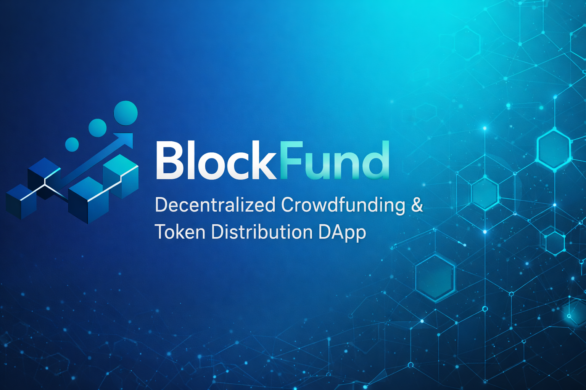

  

<h1 align="center">BlockFund</h1>

  Decentralized Crowdfunding & Token Distribution using ERC-20 Tokens

---

## Overview

BlockFund is a decentralized application built on Ethereum that implements a complete ERC-20 based crowdfunding flow.  
The system allows contributors to fund a campaign using tokens, supports optional sponsorship, and distributes the final amount to beneficiaries based on predefined weights.

The project was developed as part of the Blockchain course assignment and follows all mandatory requirements.

---

## Architecture

The system is composed of four smart contracts:

### 1. FixedPriceToken

ERC-20 token sold at a fixed price.

- Tokens are pre-minted to the token contract itself
- Users can buy tokens using ETH
- Token price can be updated by the owner
- ETH collected from sales can be withdrawn by the owner

### 2. CrowdFunding

Handles the crowdfunding process.

- Contributors deposit ERC-20 tokens
- Partial or full withdrawals are allowed before the goal is reached
- Funding states:
  - `nefinantat`
  - `prefinantat`
  - `finantat`
- After reaching the goal, sponsorship can be requested
- Final collected amount is transferred to the distribution contract

### 3. SponsorFunding

Adds an optional sponsorship bonus.

- Sponsorship amount is calculated as a fixed percentage
- Sponsorship is applied only if enough tokens are available
- Owner can buy tokens specifically for sponsorship
- Only approved crowdfunding campaigns can request sponsorship

### 4. DistributeFunding

Distributes the final amount to beneficiaries.

- Beneficiaries have associated weights (basis points)
- Total funds are fixed once at deposit time
- Each beneficiary can claim exactly once
- Distribution is proportional to the predefined weights

---

## Features

- ERC-20 token with fixed price
- Token-based crowdfunding
- Partial withdrawals before funding goal
- Optional sponsor bonus
- Secure, proportional distribution
- Protection against double-claim
- Fully tested end-to-end flow

---

## Tech Stack

- Solidity ^0.8.20
- Hardhat
- ethers.js
- Chai (testing)

---

## Project Structure
